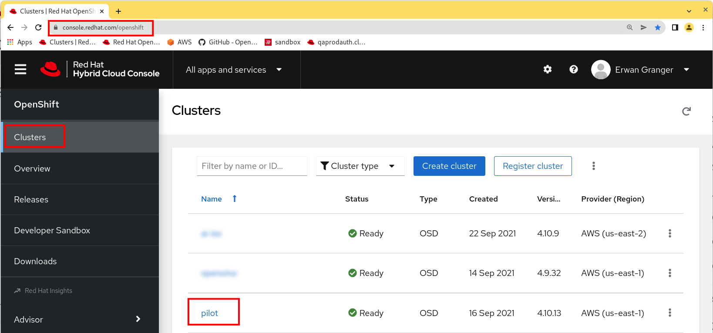
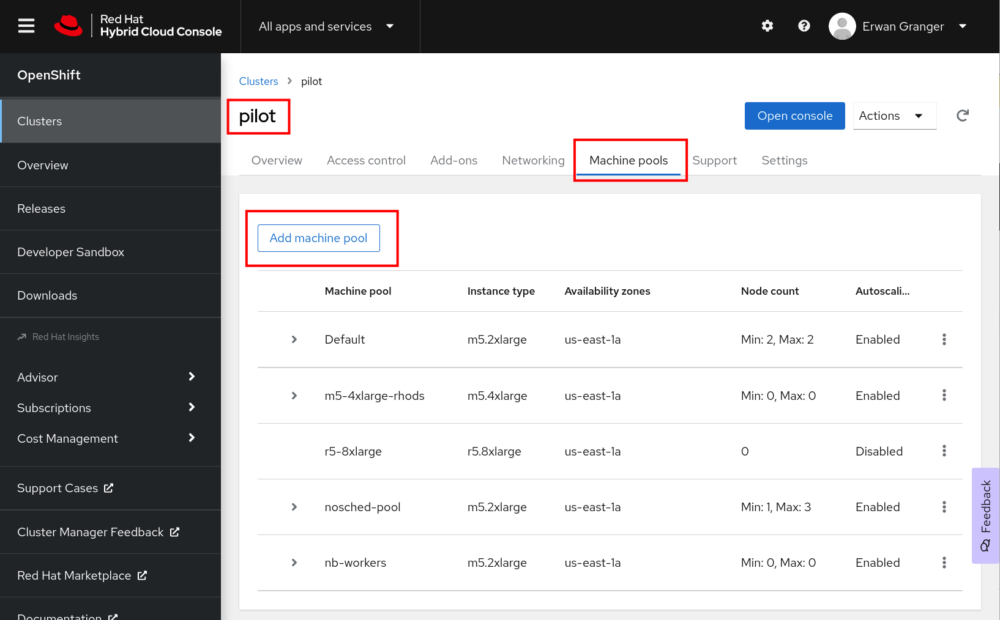
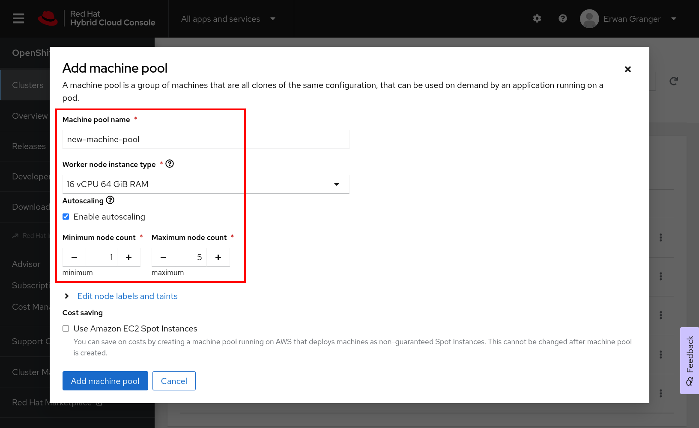
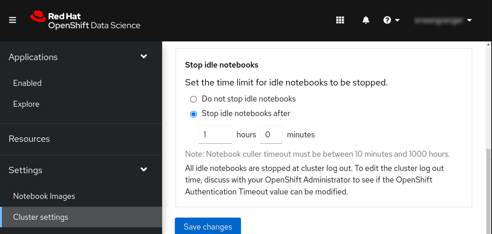
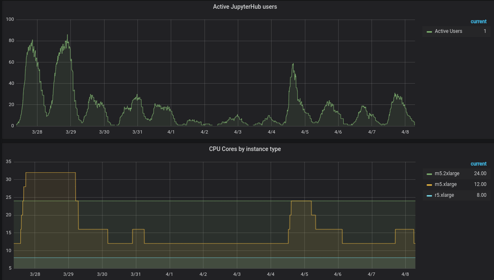
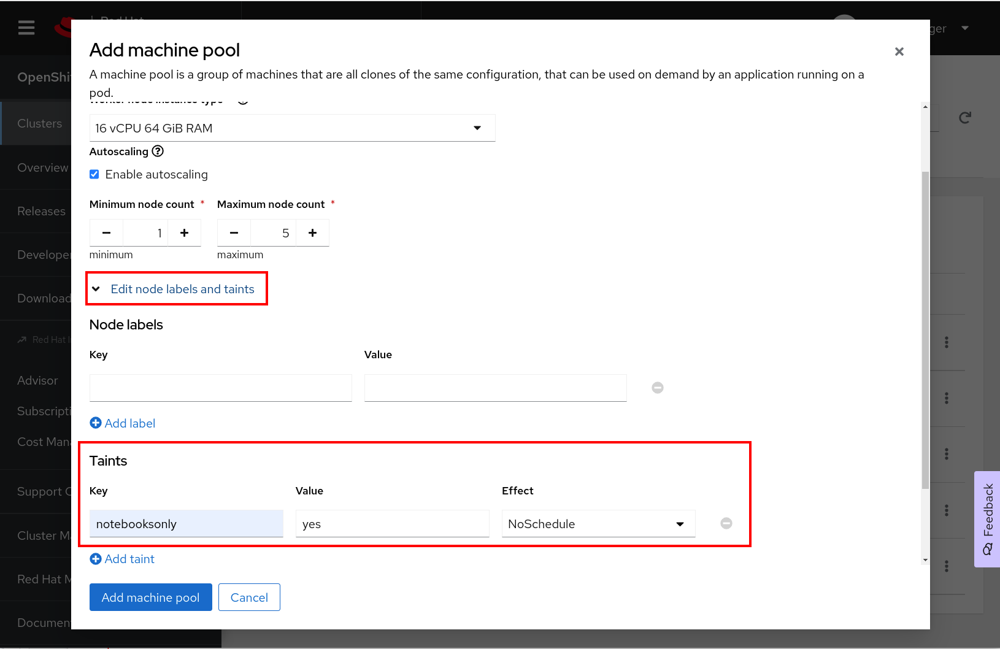
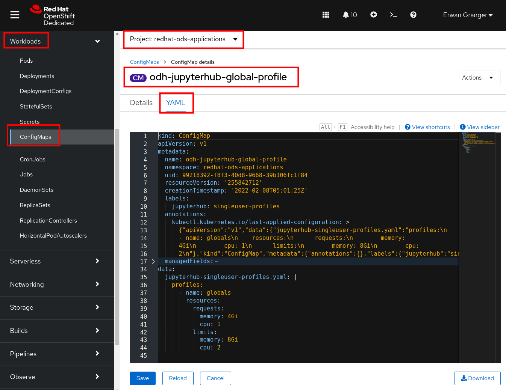

# OpenShift Machine Pool design strategies for Red Hat OpenShift Data Science

In this blog post, I will be discussing some of the details of configuring Machine Pool AutoScaling in your Managed OpenShift cluster.

Please use the flowchart below to determine whether this topic is for you.

```
   ┌───────────────────────────────────────┐
   │ Are you an Architect or Administrator │
   │ who cares for or about OpenShift?     │
   └───┬────────────────┬──────────────────┘
       │                │
       │No              │Yes
       │                │
    ┌──▼──────┐      ┌──▼─────────────┐
    │ Stop    │      │ Is your budget │
    │ reading │      │ unlimited?     │
    └─────────┘      └──┬───────────┬─┘
                        │           │
                        │Yes        │No
                        │           │
                 ┌──────▼──┐     ┌──▼──────┐
                 │ Stop    │     │ Keep    │
                 │ reading │     │ reading │
                 └─────────┘     └─────────┘
```

If you've decided to keep reading, here are the sections in this blog post:

* [Generalities](#generalities)
  * [Scalability vs Elasticity](#scalability-vs-elasticity)
  * [The autoscaling drivers](#the-autoscaling-drivers)
  * [AutoScaling in Kubernetes-land: Nodes and/or Pods](#autoscaling-in-kubernetes-land-nodes-andor-pods)
  * [Big node vs small nodes](#big-node-vs-small-nodes)
* [How to configure Node AutoScaling on ROSA/OSD](#how-to-configure-node-autoscaling-on-rosaosd)
  * [When a move isn't a move](#when-a-move-isnt-a-move)
  * [How does OpenShift decide when to add/remove nodes?](#how-does-openshift-decide-when-to-addremove-nodes)
* [Jupyter Notebooks are interactive workloads](#jupyter-notebooks-are-interactive-workloads)
  * [Long-running pods "hog" resources](#long-running-pods-hog-resources)
  * [JupyterHub Notebook pods keep nodes alive](#jupyterhub-notebook-pods-keep-nodes-alive)
  * [The antidote to idle Notebooks](#the-antidote-to-idle-notebooks)
* [What AutoScaling looks like](#what-autoscaling-looks-like)
* [Diminishing returns](#diminishing-returns)
* [Dedicating an AutoScaling Machine Pool to notebooks](#dedicating-an-autoscaling-machine-pool-to-notebooks)
* [Tainting your Machine Pool](#tainting-your-machine-pool)
* [Adding a matching Toleration to your Notebook Pods](#adding-a-matching-toleration-to-your-notebook-pods)
* [Wrapping up](#wrapping-up)
* [About the author](#about-the-author)

## Generalities
### Scalability vs Elasticity

"I've increased the size of the environment, so it's elastic!". Let me turn off my webcam so you can't see my eye roll. The only elastic thing in that sentence is the definition of the word elastic, and you're stretching it so far that it might snap.
I don't want to be that pedantic guy, but if you see something, you should say something, right?

There are many ways to explain the difference between scalability and elasticity.
Here is the way that will stick in your mind:
* scaling is like changing which hole you use on your belt: Loosen or tighten the belt, based on your weight gains or losses.
* elasticity is like wearing very stretchy sweat pants.

Now, obviously, I'm not here to dispense fashion advice. I'm just trying to make a point that these two approaches can also apply to your computing workloads.
* it's nice to be able to scale (manually)
* it's even nicer when this scaling happens automatically, and unbeknownst to you

In the rest of this post, I'll use the word AutoScaling instead of Elasticity, to keep things simpler and less open to interpretation.

### The autoscaling drivers

Let's face it... if you have a very consistent workload, which uses pretty much the same amount of resources all the time ... you don't need AutoScaling. For that matter, you don't even need Scaling at all.
And if so ... lucky you. Please e-mail me and tell me what your secret is.
Because that is a pretty rare thing.

The vast majority of computing needs tend to vary over time.
Whether it's a surge of visits on your website, a TPS report that runs all night on the last Friday of each month, or you're gearing up for Back Friday, most computing workloads are made up of peaks and valleys.

```
Compute
   ▲
   │
   │
   │
   │                             xxx
   │                            xx xx
   │                           x    x
   │                          xx     x
   │                          x      x
   │                          x      x
   │                         xx      x
   │                         x       x
   │                        xx       x                                  xxxxxx
   │                        x        x          xxxx                  xx     xx
   │           xxxx         x        x         xx   x                 x       xx
   │          xx  xx       xx        x        xx     x               xx        x
   │         xx    x       x         x       xx      x               x         x
   │        xx     x       x         xx     xx       x               x         xx
   │        x      x      x           x     x        x               x          x
   │        x      x      x            xx xx         xx              x          x
   │       xx       x     x             xxx           xx            x           x
   │       x        x     x                             xxxxxxxxxxxx            xx
   │       x        xx   xx                                                      xxx
   │      x          xxxxx                                                         xxxxxxxx
   │     xx
   │xxxxx
   │
   └───────────────────────────────────────────────────────────────────────────────────────► Time

                            Peaks and valleys. Artist rendition.
```

In face of this reality, we all tend to follow the same pattern:
1. My environment needs to be powerful enough to still work at the peak of the demand!
1. But if I make it this big all the time ... that would be costly
1. I'd better scale it up with higher demand (peak) and down when things are more idle (valleys)
1. Ok, I'm tired of paying 2 full-time salaries for people to manually scale this
1. We need this to AutoScale

### AutoScaling in Kubernetes-land: Nodes and/or Pods

```
 ┌──────────────────┐     ┌──────────────────┐
 │ ┌────┐   ┌────┐  │     │ ┌────┐   ┌────┐  │
 │ │    │   │    │  │     │ │    │   │    │  │
 │ │    │   │    │  │     │ │    │   │    │  │
 │ └────┘   └────┘  │     │ │    │   └────┘  │
 │  Pod      Pod    │     │ │    │    Pod    │
 │ ┌──────────────┐ │     │ │    │           │
 │ │              │ │     │ │    │           │    ┌──────────────────┐
 │ │              │ │     │ │    │           │    │ ┌────┐           │
 │ │              │ │     │ │    │           │    │ │    │           │
 │ └──────────────┘ │     │ └────┘           │    │ └────┘           │
 │  Pod             │     │  Pod             │    │  Pod             │
 └──────────────────┘     └──────────────────┘    └──────────────────┘
  Node 1                   Node 2                  Node 3
```

If you've spent any time working in Kubernetes Environments, you will know that [Pods](https://kubernetes.io/docs/concepts/workloads/pods/) need to land on [Nodes](https://kubernetes.io/docs/concepts/architecture/nodes/).

If you've used any Kubernetes [Deployments](https://kubernetes.io/docs/concepts/workloads/controllers/deployment/), you know that you can manually scale the number of replicas (pods) up or down.

If you've used Kubernetes [Horizontal Pod AutoScalers (HPAs)](https://kubernetes.io/docs/tasks/run-application/horizontal-pod-autoscale/), you know that this allows the number of replicas to be adjusted automatically by Kubernetes, based on some metrics that you will have defined.

And if you have used [Kubernetes Autoscaling](https://github.com/kubernetes/autoscaler), you know that it can be configured in a way that new Nodes are built and added (or removed and destroyed) automatically to the cluster, based on how full it is.

With that in mind, it's easy to see the complementarity of these 2 concepts.
* If your application requires more power, the HPA can add more Pods automatically.
* If all your Nodes are full of Pods, Kubernetes can automatically request more Nodes from the Infrastructure provider.

It's important to note however that while starting a new pod usually take a few seconds, starting a new node will usually take a few minutes.

In this post, we will focus mostly on **Node** autoscaling.

### Big node vs small nodes

One of the many existential questions that keep Cloud Architects up at night is whether it's better to have **a few large nodes** or **many smaller nodes**.
Here are some of the pros and cons of each approach.

* **few large nodes**
  * Pro: A lot of extra capacity added with each scale-up
  * Pro: Scale-up/Scale-down events are less frequent
  * Pro: Even large pods can fit on them
  * Cons: Potential for "half empty" running nodes
* **many smaller nodes**
  * Pro: Better computing density
  * Pro: "tight-fit" computing
  * Pro: Each new machine is less costly
  * Cons: More Scale-up/Scale-down events
  * Cons: Risk that large pods do not fit on smaller nodes

As you can see, there is no set rule to follow. I personally tend to start with smaller nodes and see if I can away with that approach.
As with many things in Kubernetes-land, the good news is that this decision is not set in stone, and can be revisited later on.

## How to configure Node AutoScaling on ROSA/OSD

I'll start by showing you the most basic way of configuring an AutoScaling Machine Pool.

1. Go to <https://console.redhat.com/openshift> and authenticate
1. You should see a list of your clusters:
    
1. After clicking on the cluster's name, go to the **Machine Pool** tab
1. There, you will see a button labeled **Add machine pool**
    
1. On the next screen, you get to choose:

   1. the name of the machine pool
   1. the size of _each_ individual machine in the pool
   1. whether autoscaling is enabled
   1. the min and max number of instances in the pool
1. Click **Add machine pool** to validate your choices

At this point, a new EC2 AWS instance will be added as a worker to your OpenShift cluster (because our minimum value was 1).

### When a move isn't a move

One of the most common misconceptions people have when they hear that a Kubernetes Node might be removed is that they think the pods that were running on it are somehow magically "moved" to another node.
That is not at all what happens.

Instead, what happens in the best of scenarios, is that replacement pods are started on the remaining nodes, while the original pods die.

This is by design. If your house burns down and you have to "move" into a new house, you can't take your old furniture with you. But you can go to the store and get exactly the same furniture.

This principle in Kubernetes works extremely well when you're running a stateless application, with 20 replicas. If a node dies or is removed, and we are down to 18 replicas, Kubernetes will do its utmost to keep us at 20 replicas, by starting 2 fresh replicas (pods) on the remaining nodes.

Instead, if we have a single replica, although a fresh one might be started to replace the dead one... there will be a certain amount of downtime involved no matter what.

### How does OpenShift decide when to add/remove nodes?

If you want a complete and accurate picture, you should read the [entirety of the documentation](https://docs.openshift.com/container-platform/4.10/machine_management/applying-autoscaling.html) on this topic.

If a summary is good enough:
* A new node is added when the cluster is "full"
  * In this context, full, means that one or more of the computing metrics (cpu, memory, etc) are **reserved** (and not necessarily **used**)
  * Some pods will be in Pending state until the new node is fully ready and part of the cluster
* An existing node is removed from the cluster when it is not too busy and when its pods can safely be restarted on other nodes.

## Jupyter Notebooks are interactive workloads

When a user of OpenShift Data Science starts a new Jupyter Notebook Server, a single pod is created for them. And although this is running on an OpenShift cluster, this really is a slice of the cluster, that is dedicated to that single user.
Because of the stateful nature of the work that goes on inside the notebook, a user will get a single pod, and a Persistent Volume will be attached to that pod.

This pod will keep on running uninterrupted, on the same node, unless the user decides to stop it, or the Authentication token expires. (Which usually happens 24 hours after authentication).

This behavior, while it might be good for the user, can have an adverse effect on the OpenShift environment.

### Long-running pods "hog" resources

In many ways, Data Scientists are just like the rest of us: they break for meals, they get called into long meetings, and I'm told they even sleep at night.
And therefore, if they are not diligent about their "pod hygiene", it's pretty common that those reserved slices of the environment are continuously hogged ... for no good reason.

Think of it as getting home from the store, parking in front of the house, getting out of the car, locking the doors, and **leaving the engine running until you need to drive again**. That stuff makes Kubernetes admins really sad!

### JupyterHub Notebook pods keep nodes alive

The way Jupyter Notebook Pods are created is currently not friendly with the way OpenShift does the scale-down. In essence, OpenShift will pretty much never remove a node if there are any **Notebook** pods on it. In a certain way, this is probably a good thing, since we would not want to suddenly interrupt our data scientists multiple times during the day.

However, the result is that the combination of both behaviors (long-running pods, which also keep nodes alive) can seriously impede the scaling **down** of your worker nodes.

### The antidote to idle Notebooks

At the request of a customer, to help recover some of these resources, OpenShift Data Science recently added a new administrative screen:


Idleness is not based on how "busy" the notebook is, but instead on user activity. So, if you forget to close your notebook but close your browser at 5pm, chances are, your notebook will be stopped around 6 pm (based on the above config).
Conversely, if you have a longer-running notebook (say, 2 hours) keeping the tab open should prevent the notebook from being stopped too early.

For most, this is decided when the users and the administrator of the environment reach a compromise. Increasing the idle timeout helps the users, but can increase the costs of the environment.

If some users have really long-running Jupyter Notebooks that are adversely affected, some thought should be given to batch processing, rather than artificially increasing the timeout.

As often, it is a balancing act between convenience and costs.

## What AutoScaling looks like



This is the part where I say that the above picture is self-explanatory but somehow feel the need to explain it anyways. Thank you for humoring me.

The top part shows the number of active, concurrent users. Each of them has one Notebook pod running.

The bottom part of the screen shows the number of cores of the OpenShift environment, based on instance type.

In this, you can clearly see that the yellow line (m5.xlarge) grows and shrinks, in direct relation to the number of active users. All of this happens naturally and without any human intervention.

You can also imagine that if the environment instead had a **static** size, to support the maximum possible number of users, the yellow line would have stayed up at 32 cores the whole time instead of coming back down. This would have made the environment a lot more costly than needed.

## Diminishing returns

Once one gets started down the path of autoscaling and optimization, it's quite easy to get swept up in the excitement and possible further improvements. I often hear questions like "can I schedule this to occur at a certain time?", or "what if 2 users are the last 2 on 2 distinct nodes, can I move them together on a single node?" and so on.

While these are valid questions, the answer is that it's not always worth doing, and especially, not worth worrying about at the very beginning. For example, it's not efficient to spend 2 weeks working on an optimization that results in a saving of $10/month.

## Dedicating an AutoScaling Machine Pool to notebooks

Chances are, your OpenShift cluster is running more than just the Jupyter Notebooks of RHODS. You might have enabled some other ISV-provided software, and that might be running its own pods. You might also be using OpenShift to host many more unrelated applications.

And because of that, there is a chance that some long-running, non-killable pods might land on your autoscaling nodes. If that happens, you may notice that the autoscaling pool no longer scales down. And in those cases, it's not always very evident or convenient to track down the guilty pods.

Therefore, a practice I highly recommend is configuring a **dedicated** autoscaling machine pool. When you do that, only Notebook pods are allowed to land on these nodes, and that makes their behavior easier to control and more predictable.

It's a bit more work, but worth doing.

## Tainting your Machine Pool

In the screen that allows you to add or manage Machine Pools, you can edit the Node labels and taints.

In our case, we want to add a [Kubernetes Taint](https://kubernetes.io/docs/concepts/scheduling-eviction/taint-and-toleration/). The key and value are really up to you, as long as you remember it and it's meaningful to you.

Now, before you press save on this, you need to realize that no new pods will go on these nodes! Because these nodes will be **tainted**, all pods will be **repelled** by them. So they will try to go to other nodes, but if there are none, those pods will be pending ... forever.

These settings will apply to both the current and future machines in that pool.

## Adding a matching Toleration to your Notebook Pods

To tell JupyterHub to add that toleration to the pods it launches, you have to edit the ConfigMap called `odh-jupyterhub-global-profile` in the namespace called `redhat-ods-applications`.



In this YAML, you need to append something like:

```yaml
      - name: Special Nodes
        node_tolerations:
          - key: "notebooksonly"
            operator: "Exists"
            effect: NoSchedule
```

after the block:

```yaml
data:
  jupyterhub-singleuser-profiles.yaml: |
    profiles:
      - name: globals
        resources:
          requests:
            memory: 4Gi
            cpu: 1
          limits:
            memory: 8Gi
            cpu: 2
```

The result should therefore look like:

```yaml
data:
  jupyterhub-singleuser-profiles.yaml: |
    profiles:
      - name: globals
        resources:
          requests:
            memory: 4Gi
            cpu: 1
          limits:
            memory: 8Gi
            cpu: 2
      - name: Special Nodes
        node_tolerations:
          - key: "notebooksonly"
            operator: "Exists"
            effect: NoSchedule
```

Notice that in **this** instance, the key is very important, and needs to match with the one I've assigned to the nodes earlier. However, we only check on the existence of the key, not what its value is.

These settings will take effect as soon as you save the updated YAML. There is no need to restart any pods.

At this point, any new Notebook pod started by JupyterHub should have that magic toleration that allows them to land on those dedicated nodes.
If you were to look at the YAML of a freshly launched Notebook pod, you should see:

```yaml
[...]
  tolerations:
    - key: notebooksonly
      operator: Exists
      effect: NoSchedule
[...]
```

## Wrapping up

I hope that the topics presented here helped you in understanding how autoscaling can be beneficial, and how to leverage it efficiently for a RHODS environment.

If you want to see what a RHODS environment looks like, I suggest you sign up for a free account in our [RHODS Sandbox](https://red.ht/rhods-sandbox) environment.

## About the author

[Erwan Granger](https://ca.linkedin.com/in/erwangranger) is a Senior Principal Architect at Red Hat.
When he's not trying to offload his scaling duties, he's usually helping Red Hat customers get the most out of their Red Hat OpenShift Data Science subscription.
